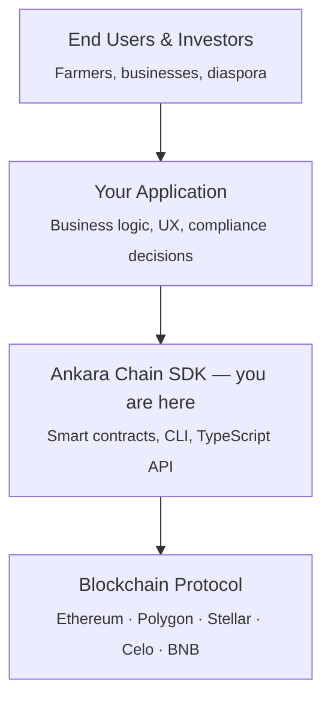

Ankara Chain sits between your application and the blockchain. You own the business layer — Ankara Chain provides the contract infrastructure, TypeScript SDK, and chain adapters that connect them. This page explains how those layers fit together so you can reason clearly about what you're building on top of.

## The Layered Model

Every interaction in Ankara Chain flows through four layers, top to bottom:



Your code interacts only with the SDK layer. The SDK translates your calls into chain-specific transactions, deploys the right contracts, and surfaces typed results back to you — without exposing raw ABI calls or protocol-specific signing flows.

## Core Layers

<CardGroup cols={3}>
  <Card title="Your Application Layer" icon="browser">
    Your Node.js backend, React frontend, or CLI tool. You own the business logic, user accounts, compliance decisions, and UX. Ankara Chain has no opinion on any of this.
  </Card>
  <Card title="Ankara Chain SDK Layer" icon="layer-group">
    `@ankarachain/sdk` — the TypeScript package you install. Exposes `TokenFactory`, `AssetRegistry`, `EscrowManager`, and more. This is where your code lives.
  </Card>
  <Card title="Smart Contract Layer" icon="file-code">
    Pre-audited Solidity contracts (EVM) and Soroban contracts (Stellar). Deployed to your chosen network under your deployer key — you own the contracts, not us.
  </Card>
</CardGroup>

## The Chain-Agnostic Adapter Pattern

The SDK uses an adapter pattern to stay chain-agnostic. Every chain-specific operation is routed through the `IAdapter` interface, which both `EVMAdapter` (for Polygon, Ethereum, BNB, Celo, localhost) and `StellarAdapter` implement in full.

```typescript
import { TokenFactory } from "@ankarachain/sdk";
import { ethers } from "ethers";

// EVM path — TokenFactory selects the right adapter for the network
const evmFactory = new TokenFactory({ network: "polygon", signer });

// Stellar path — same API, different network config
const stellarFactory = new TokenFactory({
  network: "stellar-testnet",
  stellarSecretKey: process.env.STELLAR_SECRET,
});

// Both factories expose the same deploy methods
const result = await evmFactory.deployFarmland(opts);
const result2 = await stellarFactory.deployFarmland(opts);
```

Your application code does not change when you switch chains. The `TokenFactory` constructor reads the `network` field in your config, selects the right adapter, and routes all calls through it. You never call `EVMAdapter` or `StellarAdapter` directly.

<Note>
  The `IAdapter` interface deliberately excludes raw contract-accessor methods that return chain-specific handles (like `ethers.Contract` or a Soroban `contract.Client`). Everything you need to *do* with a deployed contract — fund an escrow, mint tokens, read metadata — is exposed as a named method on the SDK classes above.
</Note>

## What Ankara Chain Does NOT Own

Understanding the boundary is as important as understanding the SDK itself.

<AccordionGroup>
  <Accordion title="Your business logic">
    Ankara Chain doesn't know what your farmland platform does, how you price assets, or when a token should be minted. You call `deployFarmland()` when your business logic says to — the SDK just executes the transaction.
  </Accordion>
  <Accordion title="Compliance decisions">
    The SDK provides a pluggable `IIdentityVerifier` interface for KYC gating, but it doesn't make compliance decisions for you. You decide which addresses are verified; the verifier contract enforces it on-chain.
  </Accordion>
  <Accordion title="User accounts and wallets">
    Ankara Chain doesn't manage user wallets, private keys, or sessions. You pass in an ethers `Signer` (or a Stellar secret key / Freighter signer) that you've already authenticated — the SDK signs and submits transactions through it.
  </Accordion>
  <Accordion title="The deployed contracts themselves">
    Every factory and token contract is deployed to your chosen network under your deployer key. You own those addresses. Ankara Chain has no custody, upgrade authority, or admin access to contracts you've deployed.
  </Accordion>
</AccordionGroup>

## Token Lifecycle

Once you deploy a factory, the typical lifecycle for a new tokenized asset looks like this:

<Steps>
  <Step title="Factory deploys the token">
    `TokenFactory` calls the on-chain `TokenFactory` contract, which deploys an ERC-1967 upgradeable proxy pointing at the selected template implementation (e.g. `FarmlandToken`). The returned `DeployResult` contains the new token's address, transaction hash, and timestamp.
  </Step>
  <Step title="AssetRegistry manages metadata">
    `AssetRegistry` reads and writes structured metadata stored directly on the deployed token contract — fields like `location`, `areaSqMeters`, `soilType`, and `valuationUSD` for farmland. It also manages the asset's lifecycle status: `DRAFT → ACTIVE → SUSPENDED → REDEEMED/EXPIRED`.
  </Step>
  <Step title="EscrowManager handles payments">
    `EscrowManager` deploys milestone-based escrow contracts that hold payment in a whitelisted stablecoin. Payers fund individual milestones; payees mark delivery; arbiters resolve disputes. All logic runs on-chain.
  </Step>
</Steps>

## Complementary Packages

The core SDK is the primary integration point, but the monorepo ships several packages that complement it:

| Package | Description |
|---|---|
| `@ankarachain/cli` | `npx ankara` — interactive wizard for deploying tokens, minting, and querying status without writing code |
| MCP Server | Model Context Protocol server for AI-assisted deployments and queries |
| Indexer | Off-chain event indexer (`@ankarachain/indexer`) with a REST API and webhook delivery for on-chain events |

These packages all consume the same SDK under the hood — if you understand how the SDK works, you understand how all of them work.
