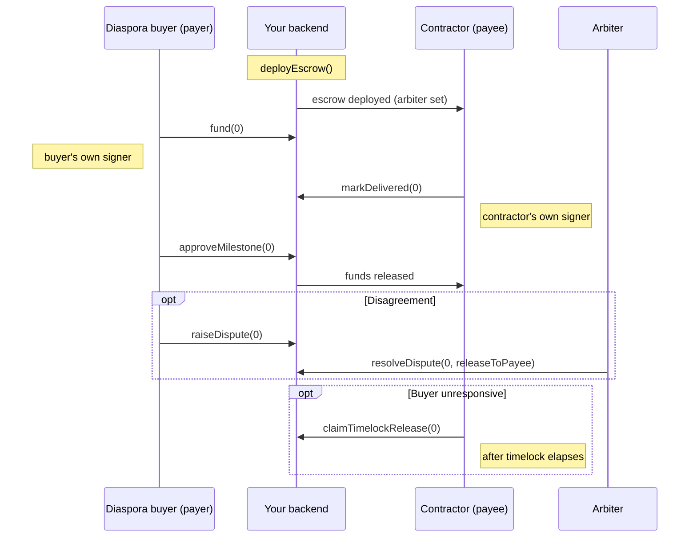

Someone working abroad wants to fund a house being built for family back home, but wiring the full contract value up front to a contractor they can't personally supervise is a real risk — money can vanish long before the roof goes on. `MilestoneEscrow` splits payment into tranches tied to physical progress: the buyer funds one milestone at a time, the contractor delivers, the buyer confirms, and only then does that tranche release. This tutorial builds a full escrow-driven product around that flow, independent of any of the six RWA asset templates — `MilestoneEscrow` is a standalone stablecoin-denominated primitive in its own right.

## What you'll build

- A backend that deploys a `MilestoneEscrow` for a construction schedule, with a platform-vetted local arbiter
- A buyer-facing flow to fund milestones and approve or dispute deliveries
- A contractor-facing flow to mark milestones delivered and claim a timelock release if the buyer goes unresponsive
- A shared progress dashboard using `getAllMilestones()` and `getActivity()`



## Prerequisites

- Node.js 18+
- A Stellar testnet account and secret key (`S...`) for the platform admin, plus test accounts for the buyer, contractor, and arbiter roles, all funded via the [Stellar Friendbot](https://friendbot.stellar.org)
- `npm install @ankarachain/sdk express`

<Warning>
  This tutorial funds milestones with the Stellar Asset Contract for XLM (`CDLZFC3SYJYDZT7K67VZ75HPJVIEUVNIXF47ZG2FB2RMQQVU2HHGCYSC`), the same testnet-only demo token used in the [Stellar Quickstart](/quickstart-stellar). XLM is volatile — deploy against a real stablecoin whitelisted on your `EscrowFactory` before handling real construction payments.
</Warning>

---

<Steps>
  <Step title="Scaffold the project">
    ```
    construction-escrow/
    ├── src/
    │   ├── config.ts          # platform admin TokenFactory
    │   ├── routes/
    │   │   ├── deploy.ts       # platform: create a new deal
    │   │   ├── buyer.ts        # fund, approve, dispute, cancel-vote
    │   │   ├── contractor.ts   # mark delivered, claim timelock, cancel-vote
    │   │   └── dashboard.ts    # shared read-only progress view
    │   └── server.ts
    ├── ankara.config.json
    ├── .env
    └── package.json
    ```

    ```typescript src/config.ts
    import { TokenFactory } from "@ankarachain/sdk";

    // Deploys are gasless for the buyer — the platform admin key pays the deployment fee.
    export const platformFactory = new TokenFactory({
      network:              "stellar-testnet",
      stellarSecretKey:     process.env.STELLAR_SECRET_KEY!,
      escrowFactoryAddress: "CDF5P3KOAU6RZGUSSA7KPNYEJMCBYAF5TVWELNFSVTM3TYP6EFUXRYVW",
    });

    export const ZERO_HASH = "0x" + "00".repeat(32);
    export const XLM_SAC_TESTNET = "CDLZFC3SYJYDZT7K67VZ75HPJVIEUVNIXF47ZG2FB2RMQQVU2HHGCYSC";
    ```
  </Step>

  <Step title="Deploy the escrow for a construction schedule">
    The platform deploys on the buyer's behalf once they've agreed a milestone schedule with the contractor, and assigns a platform-vetted local professional (e.g. a licensed quantity surveyor) as arbiter:

    ```typescript src/routes/deploy.ts
    import express from "express";
    import { platformFactory, ZERO_HASH, XLM_SAC_TESTNET } from "../config";

    export const router = express.Router();

    router.post("/api/deals", async (req, res) => {
      const { payerAddress, payeeAddress, arbiterAddress, milestones } = req.body;
      // milestones: [{ amount: string, description: string }, ...] in whole XLM units

      const result = await platformFactory.deployEscrow({
        payer:   payerAddress,
        payee:   payeeAddress,
        token:   XLM_SAC_TESTNET,
        milestones: milestones.map((m: { amount: string; description: string }) => ({
          amount:          BigInt(m.amount) * 10_000_000n, // Stellar tokens use 7 decimals
          descriptionHash: m.description ? undefined : ZERO_HASH, // pass a real hash if you store descriptions off-chain
        })),
        arbiter:                 arbiterAddress,
        timelockDurationSeconds: 7 * 24 * 60 * 60, // 7 days
      });

      // Persist { escrowAddress: result.escrowAddress, milestoneDescriptions: milestones.map(m => m.description) }
      // to your DB — the on-chain record only stores each milestone's amount and description hash.

      res.json({ escrowAddress: result.escrowAddress, txHash: result.txHash, totalAmount: result.totalAmount.toString() });
    });
    ```
  </Step>

  <Step title="Buyer: fund and approve milestones">
    Funding, approval, disputes, and cancellation votes are all payer-signed actions — build the `EscrowManager` from the buyer's own signer, not the platform's:

    ```typescript src/routes/buyer.ts
    import express from "express";
    import { TokenFactory, EscrowManager } from "@ankarachain/sdk";

    export const router = express.Router();

    // In a browser app this comes from stellarSigner (Freighter); shown here as a
    // server-relayed secret key only to keep the tutorial's request/response shape simple.
    function buyerEscrow(escrowAddress: string, buyerSecretKey: string) {
      const factory = new TokenFactory({ network: "stellar-testnet", stellarSecretKey: buyerSecretKey });
      return new EscrowManager(factory.adapter, escrowAddress);
    }

    router.post("/api/deals/:escrowAddress/fund", async (req, res) => {
      const escrow  = buyerEscrow(req.params.escrowAddress, req.body.buyerSecretKey);
      const txHash  = await escrow.fund(req.body.milestoneId);
      res.json({ txHash });
    });

    router.post("/api/deals/:escrowAddress/approve", async (req, res) => {
      const escrow = buyerEscrow(req.params.escrowAddress, req.body.buyerSecretKey);
      const txHash = await escrow.approveMilestone(req.body.milestoneId);
      res.json({ txHash });
    });

    router.post("/api/deals/:escrowAddress/dispute", async (req, res) => {
      const escrow = buyerEscrow(req.params.escrowAddress, req.body.buyerSecretKey);
      const txHash = await escrow.raiseDispute(req.body.milestoneId);
      res.json({ txHash });
    });
    ```

    <Note>
      On Stellar, funding a milestone doesn't need a separate token-approval step — the transfer authorization happens inside the same Soroban invocation as `fund()`. That's a difference from the EVM path, which needs an `approve()` call against the token contract first — see [Escrow: Fund a milestone](/guides/escrow#fund-a-milestone).
    </Note>
  </Step>

  <Step title="Contractor: mark delivery and fall back to the timelock">
    ```typescript src/routes/contractor.ts
    import express from "express";
    import { TokenFactory, EscrowManager } from "@ankarachain/sdk";

    export const router = express.Router();

    function contractorEscrow(escrowAddress: string, contractorSecretKey: string) {
      const factory = new TokenFactory({ network: "stellar-testnet", stellarSecretKey: contractorSecretKey });
      return new EscrowManager(factory.adapter, escrowAddress);
    }

    router.post("/api/deals/:escrowAddress/deliver", async (req, res) => {
      const escrow = contractorEscrow(req.params.escrowAddress, req.body.contractorSecretKey);
      const txHash = await escrow.markDelivered(req.body.milestoneId);
      res.json({ txHash });
    });

    // If the buyer neither approves nor disputes within the timelock window, the
    // contractor can force-release the delivered milestone without their sign-off.
    router.post("/api/deals/:escrowAddress/claim-timelock", async (req, res) => {
      const escrow = contractorEscrow(req.params.escrowAddress, req.body.contractorSecretKey);
      const txHash = await escrow.claimTimelockRelease(req.body.milestoneId);
      res.json({ txHash });
    });
    ```
  </Step>

  <Step title="Arbiter: resolve a dispute">
    ```typescript src/routes/arbiter.ts
    import express from "express";
    import { TokenFactory, EscrowManager } from "@ankarachain/sdk";

    export const router = express.Router();

    router.post("/api/deals/:escrowAddress/resolve", async (req, res) => {
      const { arbiterSecretKey, milestoneId, releaseToPayee } = req.body;

      const factory = new TokenFactory({ network: "stellar-testnet", stellarSecretKey: arbiterSecretKey });
      const escrow  = new EscrowManager(factory.adapter, req.params.escrowAddress);

      const txHash = await escrow.resolveDispute(milestoneId, releaseToPayee);
      res.json({ txHash });
    });
    ```

    <Tip>
      If no arbiter was set at deployment (or the arbiter is unresponsive), a disputed milestone has no arbitration path — the only way forward is `voteCancel()` from both the payer and the payee, which refunds any remaining locked balance to the buyer. Always set an arbiter for real construction deals.
    </Tip>
  </Step>

  <Step title="Shared progress dashboard">
    Reads don't require a specific party's signature — the platform's own adapter is fine here:

    ```typescript src/routes/dashboard.ts
    import express from "express";
    import { EscrowManager } from "@ankarachain/sdk";
    import { platformFactory } from "../config";

    export const router = express.Router();

    router.get("/api/deals/:escrowAddress", async (req, res) => {
      const escrow = new EscrowManager(platformFactory.adapter, req.params.escrowAddress);

      const [milestones, activity, remaining] = await Promise.all([
        escrow.getAllMilestones(),
        escrow.getActivity(),
        escrow.remainingBalance(),
      ]);

      res.json({
        milestones: milestones.map(m => ({ ...m, amount: m.amount.toString() })),
        activity,
        remainingBalance: remaining.toString(),
      });
    });
    ```

    A minimal React timeline built on that endpoint:

    ```tsx src/components/DealTimeline.tsx
    "use client";

    import { useEffect, useState } from "react";

    const STATUS_LABEL = ["Pending", "Delivered", "Disputed", "Released", "Refunded"];

    export function DealTimeline({ escrowAddress }: { escrowAddress: string }) {
      const [deal, setDeal] = useState<null | { milestones: any[]; activity: any[] }>(null);

      useEffect(() => {
        fetch(`/api/deals/${escrowAddress}`).then(r => r.json()).then(setDeal);
      }, [escrowAddress]);

      if (!deal) return <p>Loading…</p>;

      return (
        <ol>
          {deal.milestones.map((m, i) => (
            <li key={i}>
              Milestone {i}: {STATUS_LABEL[m.status]} — {m.funded ? "funded" : "unfunded"}
            </li>
          ))}
        </ol>
      );
    }
    ```
  </Step>
</Steps>

---

## Going further

- **Cancellation**: either party can call `voteCancel()` — the deal only cancels once *both* have voted, refunding any unfunded/remaining balance to the buyer. Wire this up the same way as `fund`/`markDelivered` above, from each party's own signer.
- **Applying this to a tokenized asset instead of a service deal**: the [Invoice Financing Marketplace tutorial](/tutorials/invoice-financing-marketplace) shows a simpler, single-payment alternative for receivables — use escrow instead when you need multiple tranches tied to verifiable delivery.

## Next steps

<CardGroup cols={2}>
  <Card title="EscrowManager" icon="handshake" href="/sdk/escrow-manager">
    Full reference for every lifecycle method, including `setArbiter` and `pause`/`unpause`.
  </Card>
  <Card title="Escrow Guide" icon="workflow" href="/guides/escrow">
    The EVM-side walkthrough, including the ERC-20 `approve()` step this Stellar tutorial skips.
  </Card>
  <Card title="CLI Commands" icon="terminal" href="/cli/commands">
    `ankara deploy-escrow` and the full set of `ankara escrow-*` commands.
  </Card>
  <Card title="Contracts: Escrow" icon="scroll-text" href="/contracts/escrow">
    The on-chain `MilestoneEscrow` architecture and dispute state machine.
  </Card>
</CardGroup>
