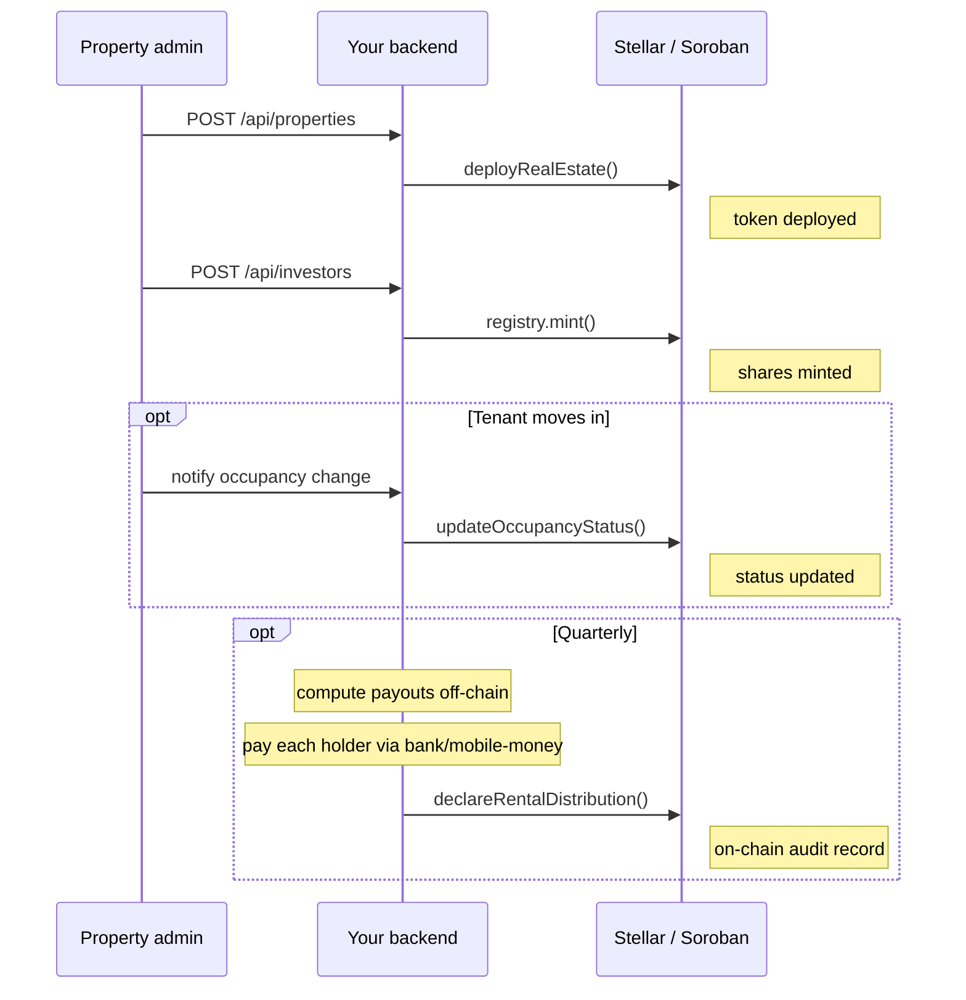

A single Lagos office building is too expensive for most individual investors — but a hundred people can each own a slice of it, and split the rent it earns every quarter. This tutorial builds that product: a `RealEstateToken` representing fractional ownership of one property, an occupancy/valuation admin flow, and a rental income distribution that's declared on-chain for a permanent audit trail even though the actual cash payout happens off-chain.

## What you'll build

- An admin script that deploys one `RealEstateToken` per property with location, valuation, and rental yield metadata
- Backend routes to onboard investors (mint shares) and update occupancy status as tenants change
- A quarterly rental distribution job: compute each holder's share off-chain, pay them, then call `declareRentalDistribution()` to publish an immutable on-chain record of the total distributed
- A React dashboard showing a property's live occupancy, valuation, and the investor's share count



## Prerequisites

- Node.js 18+
- A Stellar testnet account and secret key (`S...`), funded via the [Stellar Friendbot](https://friendbot.stellar.org)
- `npm install @ankarachain/sdk express`

---

<Steps>
  <Step title="Scaffold the project">
    ```
    reit-platform/
    ├── src/
    │   ├── config.ts
    │   ├── routes.ts             # property + investor onboarding
    │   ├── jobs/
    │   │   └── distributeRent.ts  # quarterly rental distribution
    │   └── server.ts
    ├── ankara.config.json
    ├── .env
    └── package.json
    ```

    ```typescript src/config.ts
    import { TokenFactory } from "@ankarachain/sdk";

    export const factory = new TokenFactory({
      network:          "stellar-testnet",
      stellarSecretKey: process.env.STELLAR_SECRET_KEY!,
      factoryAddress:   "CBMBI63UU6KJIZ5KUVP6A3FGMBMS4R3OXSY27NQNK5PPLCWJW7DPSEEF",
    });
    ```
  </Step>

  <Step title="Deploy a token per property">
    The same `deployRealEstate()` call works unchanged on EVM by passing an `EVMAnkaraChainConfig` to `TokenFactory` instead — see [Deploy a Token](/guides/deploy-token) for that variant.

    ```typescript src/routes.ts
    import express from "express";
    import { AssetRegistry } from "@ankarachain/sdk";
    import { factory } from "./config";

    export const router = express.Router();

    router.post("/api/properties", async (req, res) => {
      const { name, symbol, propertyId, locationAddress, totalAreaSqMeters, valuationUSD, rentalYieldBps } = req.body;

      const now = BigInt(Math.floor(Date.now() / 1000));

      const result = await factory.deployRealEstate({
        name, symbol,
        assetId:     propertyId,
        countryCode: "NG",
        metadata: {
          propertyId,
          propertyType:      "Commercial",
          locationAddress,
          totalAreaSqMeters: BigInt(totalAreaSqMeters),
          titleDocumentHash: "0x" + "00".repeat(32),
          valuationUSD:      BigInt(valuationUSD) * 10n ** 18n,
          rentalYieldBps:    BigInt(rentalYieldBps),   // e.g. 600n = 6%
          occupancyStatus:   "Vacant",
          developerAddress:  req.body.developerAddress,
          lastUpdated:       now,
        },
      });

      // Persist { tokenAddress: result.tokenAddress, propertyId } to your DB here.

      res.json({ tokenAddress: result.tokenAddress, txHash: result.txHash });
    });
    ```
  </Step>

  <Step title="Onboard investors and track occupancy">
    ```typescript src/routes.ts (continued)
    router.post("/api/investors", async (req, res) => {
      const { tokenAddress, investorAddress, shareAmount } = req.body;

      const registry = new AssetRegistry(factory.adapter, tokenAddress, "real-estate");
      const txHash   = await registry.mint(investorAddress, BigInt(shareAmount));

      // Record { tokenAddress, investorAddress, shareAmount } in your own cap-table store —
      // you'll need it below to compute each holder's rental distribution.

      res.json({ txHash });
    });

    router.post("/api/properties/:tokenAddress/occupancy", async (req, res) => {
      const registry = new AssetRegistry(factory.adapter, req.params.tokenAddress, "real-estate");
      const txHash   = await registry.updateOccupancyStatus(req.body.status); // "Vacant" | "Owner-occupied" | "Tenanted"
      res.json({ txHash });
    });
    ```
  </Step>

  <Step title="Distribute rental income">
    `declareRentalDistribution()` does **not** move any funds — it only records an immutable on-chain declaration of the total distributed, for audit and investor-trust purposes. The actual payout to each holder is your platform's own off-chain step, computed from the cap table you built while minting.

    ```typescript src/jobs/distributeRent.ts
    import { AssetRegistry } from "@ankarachain/sdk";
    import { factory } from "../config";

    async function distributeQuarterlyRent(tokenAddress: string, totalRentUSD: bigint) {
      const registry    = new AssetRegistry(factory.adapter, tokenAddress, "real-estate");
      const totalSupply = await registry.getTotalSupply();
      const holders     = await getCapTable(tokenAddress); // your DB: [{ address, shareAmount }]

      // 1. Pay each holder off-chain, proportional to their share of totalSupply.
      for (const holder of holders) {
        const holderShareUSD = (totalRentUSD * holder.shareAmount) / totalSupply;
        await payOutToBankAccount(holder.address, holderShareUSD); // your fiat payout integration
      }

      // 2. Publish an immutable on-chain record of what was distributed, for auditability.
      const txHash = await registry.declareRentalDistribution(totalRentUSD);
      console.log(`Declared rental distribution of ${totalRentUSD} wei: ${txHash}`);
    }
    ```

    <Warning>
      Because `declareRentalDistribution()` only records a declaration, always run the actual off-chain payout *before* calling it — otherwise the on-chain record won't match what investors actually received. See [AssetRegistry: Real Estate Methods](/sdk/asset-registry#real-estate-methods).
    </Warning>
  </Step>

  <Step title="Show the property to investors">
    ```tsx src/components/PropertyCard.tsx
    "use client";

    import { useAsset, useTokenBalance } from "@ankarachain/sdk/react";
    import { ethers } from "ethers";

    export function PropertyCard({ tokenAddress, walletAddress }: { tokenAddress: string; walletAddress: string }) {
      const asset   = useAsset({ tokenAddress, template: "real-estate", network: "stellar-testnet" });
      const balance = useTokenBalance({ tokenAddress, walletAddress, network: "stellar-testnet" });

      if (asset.isLoading) return <p>Loading…</p>;

      const meta = asset.metadata as { occupancyStatus?: string; rentalYieldBps?: bigint } | null;

      return (
        <div className="property-card">
          <h3>{asset.name}</h3>
          <p>Valuation: ${asset.valuationUSD != null ? ethers.formatEther(asset.valuationUSD) : "—"}</p>
          <p>Rental yield: {meta?.rentalYieldBps != null ? Number(meta.rentalYieldBps) / 100 : "—"}%</p>
          <p>Occupancy: {meta?.occupancyStatus ?? "—"}</p>
          <p>Your shares: {balance.formatted ?? "0"}</p>
        </div>
      );
    }
    ```
  </Step>
</Steps>

---

## Going further

- **Raising fresh investor capital in local fiat**: reuse the on-ramp flow from the [Farmland Investment Platform tutorial](/tutorials/farmland-investment-platform) instead of minting shares directly.
- **Revaluation**: as the property is reappraised, call `registry.updateValuation(newValuationUSD)` (shared with the Farmland template) — see [AssetRegistry](/sdk/asset-registry#farmland-real-estate-methods).

## Next steps

<CardGroup cols={2}>
  <Card title="AssetRegistry" icon="database" href="/sdk/asset-registry">
    Full reference for `updateOccupancyStatus`, `declareRentalDistribution`, and `updateValuation`.
  </Card>
  <Card title="Asset Templates" icon="layer-group" href="/concepts/asset-templates">
    The full `RealEstateMetadata` schema.
  </Card>
  <Card title="React Hooks" icon="react" href="/guides/react-hooks">
    `useAsset` and `useTokenBalance` in full.
  </Card>
  <Card title="Mint Tokens" icon="coins" href="/guides/mint-tokens">
    KYC-gated transfers with `WhitelistVerifier`, in depth.
  </Card>
</CardGroup>
